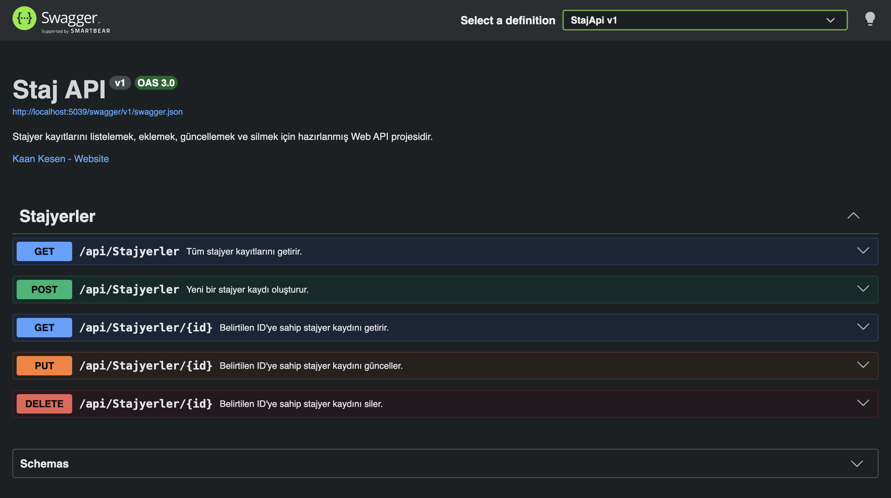

# Staj API

.NET 10 ve ASP.NET Core Web API ile hazırlanmış basit bir stajyer yönetim projesidir. Veriler uygulama belleğinde tutulur; veritabanı kullanılmaz.

## Swagger



## Endpointler

| Metot | URL | Açıklama |
|---|---|---|
| GET | `/api/Stajyerler` | Tüm stajyerleri listeler. |
| GET | `/api/Stajyerler/{id}` | ID değerine göre bir stajyer getirir. |
| POST | `/api/Stajyerler` | Yeni bir stajyer oluşturur. |
| PUT | `/api/Stajyerler/{id}` | Bir stajyer kaydını günceller. |
| DELETE | `/api/Stajyerler/{id}` | Bir stajyer kaydını siler. |

## Çalıştırma

```bash
dotnet restore
dotnet run
```

Swagger: `http://localhost:5039/swagger`
